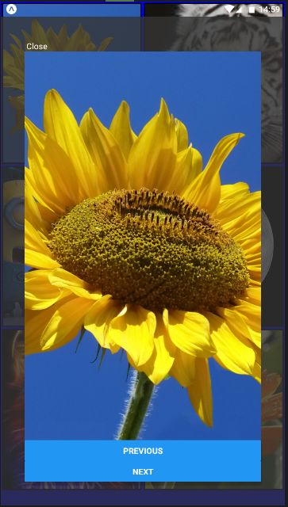

# 🖼️ React-Native-Gallery-App

A simple and user-friendly mobile gallery application built with React Native. This app allows users to browse images, open them in full view, and navigate through them using next and previous controls.

🚀 Features
- 🖼️ Display a gallery with 6 images
- 🔍 Tap on any image to view it in full screen
- ⏭️ Navigate between images using Next and Previous buttons
- 📱 Smooth mobile experience (iOS & Android)

🛠️ Technologies Used
- React Native
- JavaScript

📦 Installation
To run the project locally:
```
git clone https://github.com/BalamiRR/Gallery-App.git
cd react-native-gallery-app
npm install
npx react-native run-android
# or
npx react-native run-ios
```




🎮 How to Use
- Open the app to see the gallery view
- Tap on any image to open it
- Use Next and Previous buttons to browse images
- Navigate back to the gallery anytime

📌 Notes

This project is built for learning purposes and demonstrates basic image gallery functionality in React Native.
